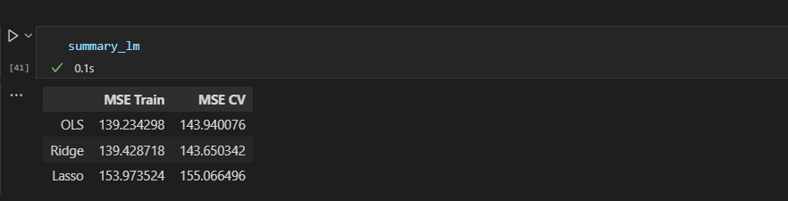
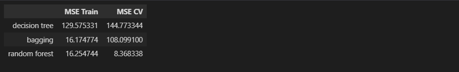

# Predicting Spotify Track's Popularity from Korean Music Groups based on the Music Features and Group Profiles

## Introduction

Spotify as the global streaming platform distributed k-pop songs to all over the world. Kpop songs frequently charting and become popular stream in Spotify. Every year in Korea, many entertainment companies make debuts their produced k-pop groups. This analysis began for predicting k-pop track's popularity on Spotify with regression method. The track's popularity in Spotify is a range from 0 to 100, with 100 being the most popular. For independent variables we're using song/track's profile (musicality, duration, artists popularity, spotify followers) and k-pop group's profile (average age of members, days from debut, and company).

This analysis predict Spotify tracks popularity by applying Linear Model (with Ridge and Lasso Regularization) and Ensemble Model (Decision Tree, Bagging, and Random Forest). Linear Model was decided to be applied first because from exploratory process there are some linear correlations between dependent and independent variables. After modifying with Ridge and Lasso Regularization, there are not much differences in mean squared error. 

## Related Work
[Middlebrook and Sheik (2019)](https://arxiv.org/pdf/1908.08609.pdf) used Spotify Popularity Track data alongside with Billboard Charts data to classify which track would be a hit in Billboard. The data splitted into train-validation-test without cross validation process, then use four different models, Logistic Regression, Neural Network, SVM, and Random Forest for predicting. The result showed SVM and RF outperform the two other models. This analysis used one of ensemble model, Random Forest, which has been decided to use 8 maximum number of features, 80 estimators, and minimum split condition of two samples under Gini Criterion.

[Nujkamp, 2018](http://essay.utwente.nl/75422/1/NIJKAMP_BA_IBA.pdf) investigates the relationship between track popularity (stream count) and audio features in Spotify using linear regression approach. The analysis preceded by obtain correlation analysis between variables. By using step-wise method, only 9 relevant variables selected. This analysis found the relationship between streaming popularity and audio features in Spotify was weak. Its R^2 or explanatory power is 20.2% or the model explains 20.2% of the variation in stream count. The model concluded not effective to explaining stream count on its own. The other Spotify analysis is from [Ochi et al, 2021](https://arxiv.org/ftp/arxiv/papers/2108/2108.02370.pdf), with additional data about top songs by Country in Billboard chart. The analysis concluded, most influential features are valence and tempo, songs with high value of valence and tempo has high probability of being a hit in music charts.

## Dataset and Features

This analysis is using two separate datasets, spotify data set and korean music groups dataset. After merging and preparation, the final data has 2043 rows then separated into 80% training data and 20% test date. Training data would process into cross validation steps when training the model. The pre processing data consists of handling missing value, because there are many missing values in two numeric columns (more than 30%) and it's quite important columns, those columns were grouped into categorical forms. Another preprocessing is converting categorical columns into numerical by Label Encoder and Hot Encoder method.

The features used in this analysis are:
- `tracks_popularity`: popularity of track in range 0-100 
- `artist_popularity`: popularity of artist in range 0-100 
- `duration_ms`: duration of the song (milisecond)
- `explicit`: whether it contains explicit content or not
- `danceability`: how danceable a song is in range 0-1
- `energy`: how energized a song is in range 0-1
- `time_signature`: major note of track [0:C, 1:C#, 2:D, ...] using Pitch Class notation
- `loudness`: how loud a song is in db
- `mode`: the modality of track (0: minor, 1: major)
- `speechiness`: the presence of spoken words in track range 0-1
- `acousticness`: how acoustic a track is in range 0-1
- `instrumentalness`: the absence of vocal sounds in track in range 0-1
- `liveness`: the presence of audience in track in range 0-1
- `the valence`: positiveness of the track in range 0-1 (high valence means the track sounds more positive, happy, cheerful or euphoric)
- `tempo`: overal tempo of track in BPM
- `time_signature`: a sign used in music to indicate meter of composition (mostly 4)
- `followers`: amount followers the group has in spotify
- `big5_company`: condition if the group comes from current big entertainment company (SM, JYP, YG, Cube, or HYBE/Big Hit)
- `active`: condition if the group still active or not
- `days_after_debut`: how many days the track released after the group's debut
- `mean_age_released`: average of the member's age when the track was released

These are the source links of Spotify and Korean music Data :
- [Spotify Dataset 1921-2020, 600k+ Tracks](https://www.kaggle.com/datasets/yamaerenay/spotify-dataset-19212020-600k-tracks)
- [Kpop Database](https://dbkpop.com/) (The data have been scraped, the scraping code can be seen in `scrape_data.ipynb`)

## Metode
Linear regression is used to model the relationship between a dependent variable and one or more independent variables. Regularization is a technique used to prevent overfitting in linear regression models. The regularization method adds a penalty term to the loss function, which helps reduce the coefficients of independent variables irrelevant to the model.

Two types of regularization will be applied in this analysis, Ridge and Lasso. Ridge regression is a type of regularization technique that adds a penalty term proportional to the square of the coefficient magnitude. The term penalty helps reduce the impact of independent variables that are not important to the model. Lasso regression is the other type of regularization technique that adds a penalty term proportional to the absolute value of the coefficient magnitude. Lasso regression not only helps reduce the impact of irrelevant independent variables but also performs feature selection by setting unimportant variable coefficients to zero. Ridge and Lasso regression can be used to prevent overfitting in linear regression models.

Ensemble models are techniques that combine multiple models to improve the performance of machine learning algorithms. Decision tree is a type of model that makes decision based on a set of rules that divide data into subsets. Decision tree can be used as model ensemble in two ways, with bagging or boosting.

Bagging (Bootstrap Aggregating) is an ensemble method that generating multiple decision tree models using random subsets of training data. The final prediction is the average of the predictions made by all models. Random Forest is another ensemble method that uses bagging and decision trees. This involves creating multiple decision tree models using random subsets of training data and randomly selected features. The final prediction is the average of the predictions made by all models. Random Forest is preferred over Bagging when dealing with noisy data.

Model ensemble methods such as Bagging and Random Forest (which used Decision Tree), can be used to improve the performance of machine learning models, by combining multiple models together, which makes them less vulnerable to overfitting and increasing their predictive power.

## Result
The first model to be applied is basic Linear Model, due to EDA results in correlation matrix, there is assumption about linear relations between dependent and independent variables. The basic linear model and with regularization produces MSE that is not much different in training and cross validation set.

Meanwhile, decision tree model and ensemble model (Bagging Trees and Random Forest) has a significantly smaller MSE.

## Conclussion/Future Work

